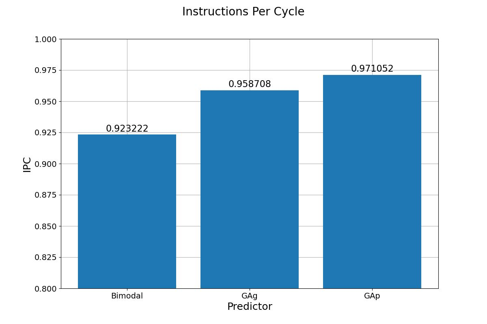
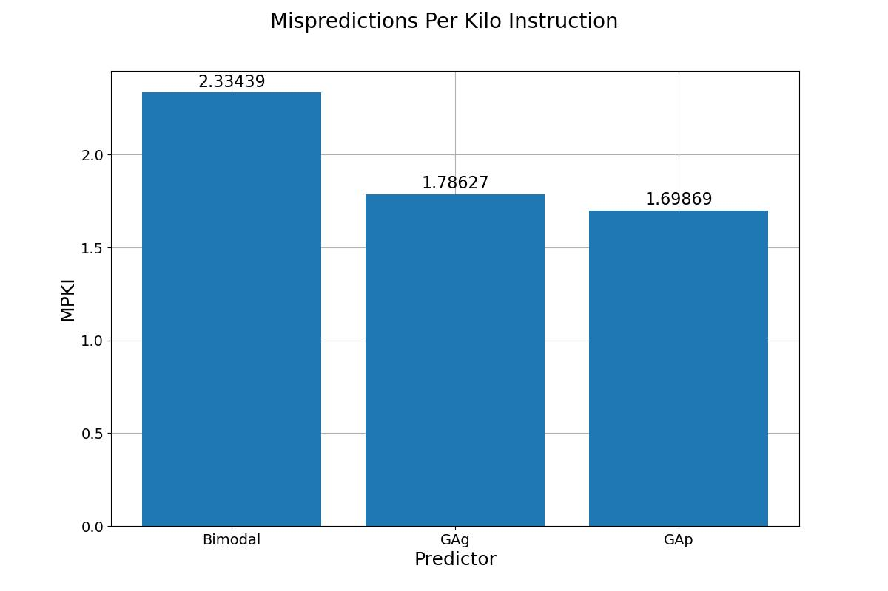

# Branch prediction

The branch predictors to be compared were GAp and GAg against the baseline of the bimodal predictor (with identical sizes).

The ipc and mpki averaged over the set of traces were compared:

As can be seen from the graphs, GAg and GAp bypass the bimodal predictor and GAp better than GAg, perhaps this was expected, because the bimodal predictor uses information only about one branch, and GAp and GAg use global history and in fact have connections between branches, GAp in turn has a greater context when predicting, because the index in the table takes into account the instruction address and the global shift register, unlike GAg ​​which simply uses the global shift register as a context.
