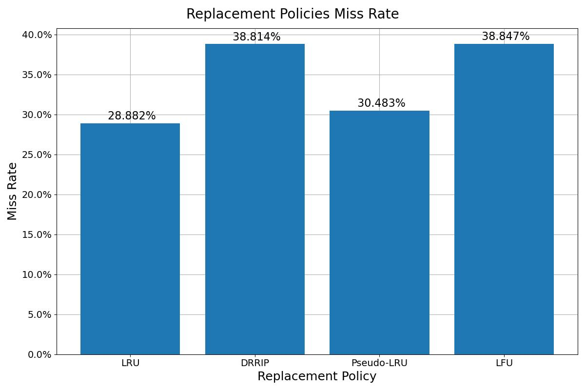
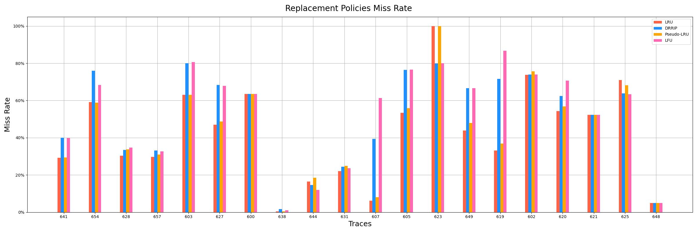

# L2 replacement policies.

4 policies will be compared:

LRU, DRRIP, PLRU (Pseudo LRU), LFU

Expected result:

| Policy    | Hit Rate (+ = better)   |  
| --------- | ----------------------- | 
| LRU       | +                         | 
| PLRU      | + (but a little worse then LRU)  |
| LFU       | + (worse than LRU on unstable patterns, but in common the same)                        |
| DRRIP     | ++ (looks like gold middle)          |

Results on pictures

Results are non-theoretically expected, but LRU and PLRU like expected.
DRRIP and LFU much worse then LRU-like. I think this behaviour because of benchmarks data very temporal and stable reuse.
