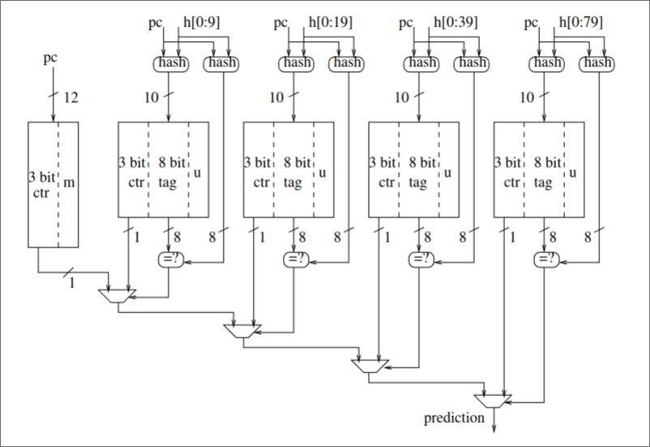
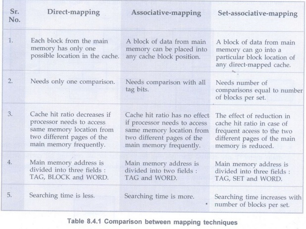
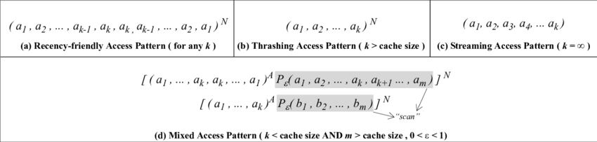
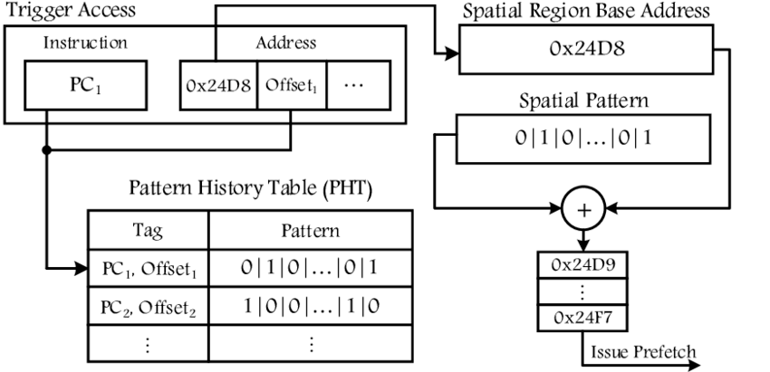
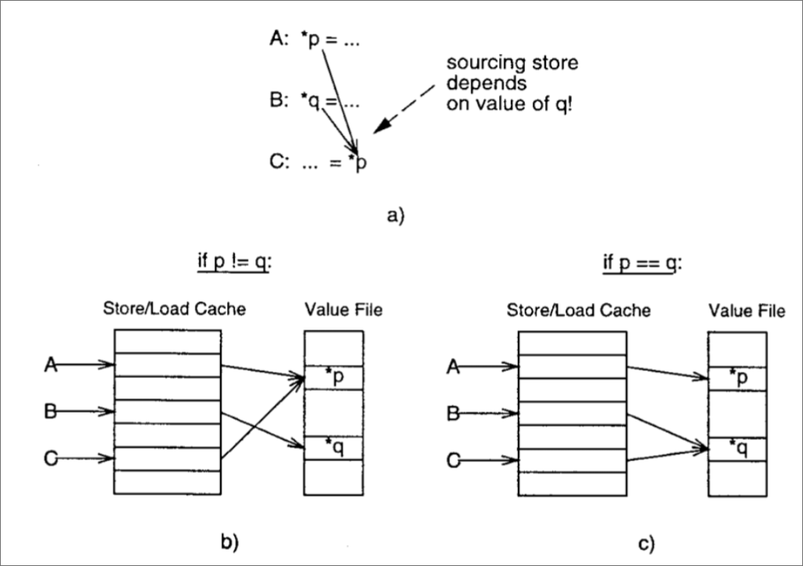

# 3. **Theoretical minimum.**

## **Introduction:**

1. ### **Golden rule of CS:**

    ```math
    Performance = \dfrac{1}{Time} = \dfrac{1}{N_{instrs} \cdot CPI \cdot T_{cycle}} = \dfrac{1}{N_{instrs}} \cdot IPC \cdot f,
    ```

    * $`N_{instrs}`$ is number of instructions (depends on SW algorithms, ISA)
    * $`IPC`$ is number of instructions per cycle
    * $`f`$ is a frequency (depends on hardware like transistors).

    ```math
    Power = Power_{dynamic} + Power_{static} = C \cdot V^2 \cdot f + leakage,
    ```

    * $`C`$ is capacitance
    * $`V`$ is voltage
    * $`f`$ is frequency

---
2. ### **Moore’s law and Dennard scaling.**
    * Moore’s law

        "The number of transistors on integrated circuits doubles approximately every 18 months(from 1975, it's 2 years)."

        In other words, technological advancements enable higher transistor density without raising costs. This means the number of transistors grows while the physical size of the chip remains the same.

    * Dennard scaling

        "With each technology generation, as transistors get smaller, power consumption per unit area remains the same. Both voltage and current scale downward with transistor length."
        
        As transistors shrink in size, their operating voltage and power consumption decrease proportionally, keeping power density constant. This allows for higher clock frequencies without overheating.


---
3. ### **Dennard scaling ending (2005).**
    Dennard scaling ended when voltage could no longer decrease at the same rate as transistor sizes. This led to rising power density and thermal constraints. As a result, the industry shifted focus to alternative performance boosters — multicore CPUs, better parallelism, and specialized processors like GPUs.

---
4. ### **Bypassing / Data forwarding optimization**

    Consider these two consecutive instructions:

    ```asm
    #1. sub x2, x1, x0  
    #2. sub x3, x2, x4  
    ```

    when #1 completes the execution stage, the result for x2 is already available — even before it’s written back to the register file. Instead of stalling the pipeline until #1 finishes its writeback stage, we can forward (bypass) the computed value of x2 directly to #2.

    This optimization reduces stalls and improves pipeline efficiency. However, it requires a Forwarding Unit to detect such dependencies and route the correct values between stages, which requires more complex logic

---
5. ### **Instruction-Level Parallelism (ILP)**


    ILP refers to a processor's capability to execute multiple instructions simultaneously within a single thread, improving performance by overlapping or parallelizing instruction execution.

    **Key Optimizations for ILP:**

    1. **Superscalar Architecture**

        Mechanism: Dynamically issues and executes multiple instructions per clock cycle using multiple execution units (ALUs, FPUs, load/store units).

        Advantage: Exploits parallelism without requiring explicit programmer effort (hardware handles dependency checking and scheduling).

    2. **VLIW (Very Long Instruction Word)**

        Mechanism: Bundles independent operations into a single long instruction word, executed in parallel by dedicated functional units.

        Key Trade-off: Shifts scheduling burden to the compiler (static scheduling), reducing hardware complexity, but requiring intelligent code generation.

    3. **Vector Processors**

        Mechanism: Executes single instructions on entire arrays (vectors) of data, minimizing loop overhead and control logic.

        Use Case: Ideal for data-parallel workloads (e.g., scientific computing, multimedia).

    Why These Optimizations Matter:
    * Superscalar: Balances parallelism with hardware flexibility.
    * VLIW: Maximizes deterministic parallelism (used in DSPs, some GPUs).
    * Vector Processors: Optimize throughput for regular data patterns (e.g., SIMD extensions like AVX, Neon).


## **Out-of-Order:**

1. ### **Reorder Buffer (ROB):**

    Out-of-Order (O3) CPUs overcome in-order superscalar limitations by executing independent instructions out of sequence:

    * Instructions enter a ReOrder Buffer (ROB)

    * The CPU checks dependencies and dispatches ready instructions to free execution units

    * Independent ops execute early, avoiding stalls

    This enables higher throughput despite dependencies.

---
2. ### **Why not huge ROB (1e4 cells) if we have enough power/area to be occupied?**

    Limitations of the ReOrder Buffer (ROB)

    While ROB enables out-of-order execution, it faces two key challenges:

    * Branch Mispredictions

        * Branch predictors help with accuracy "a"

            But probability of keeping Nth instruction decreases exponentially:
            ```math
            P(\text{n'th instruction remains}) = a^{n}
            ```
            if a = 90%, then P(100) = 12%, which bad.

            Mispredictions force pipeline flushes and re-execution

    * Exception Handling

        Any exception triggers full ROB flush. Large ROBs incur significant penalties:

        * Longer refetch latency

        * Wasted work from discarded instructions

    Additional Performance Costs
    The ROB requires two expensive searches:

    * Allocation Search (per instruction):

        Identifies producer instructions for operands

    * Scheduling Search (per cycle):

        Finds ready instructions to dispatch

    These searches become more costly with larger ROB sizes, creating a tradeoff between:
    
        ✓ Potential parallelism (bigger ROB)
        ✗ Higher search latency
        ✗ More wasted work on flushes

    The optimal ROB size balances these factors for maximum performance.

---
3. ### Eliminating False/Anti- Dependencies in registers. Register Aliases Table(RAT):

    **Register Renaming in Action**

    Consider this instruction sequence:
    ```asm
    #1. r1 ← r8 * r9     # Mult
    #2. r8 ← r1 + r2     # Depends on #1
    #3. r1 ← r5 - 2      # New r1 value
    #4. r6 ← load[r1 + r6] # Depends on #3
    ```

    **The Problem:**
    - Apparent WAR (Write-After-Read) dependency between i3 and i1-i2
    - False dependency limits parallel execution

    **Solution: Register Renaming**
    ```asm
    #1. pr1 ← pr8 * pr9
    #2. pr8 ← pr1 + pr2   # Uses original pr1
    #3. pr10 ← pr5 - 2    # New physical register
    #5. pr6 ← load[pr10 + pr6] # Uses renamed pr10
    ```

    **Key Mechanisms:**
    1. **Mapping Rules:**
    - Producer + all consumers → same physical register
    - Original architectural register updated only at retirement

    2. **RAT (Register Alias Table):**
    - Tracks current physical register mappings
    - Updated during renaming

    3. **Recovery Protocol:**
    - Each ROB entry saves previous mapping
    - On flush: ROB restores RAT history
    - Ensures correct state after mispredictions/exceptions

    **Benefits:**
    * Eliminates false dependencies
    * Enables more parallel execution
    * Maintains architectural consistency

---
4. ### Instruction Queue:

    Here's a more structured and precise rephrasing:

    **ROB and Scheduler Queue Management**

    1. **Search Optimization**:
    - The ROB performs two critical searches:
        *Allocation Search* (per instruction): Locates producer instructions for operand dependencies
        *Scheduling Search* (per cycle): Identifies ready instructions for execution
    - To minimize search overhead, only active (non-completed) instructions are tracked in the smaller Scheduler Queue (~20-30% of ROB size)                                                                                      

    2. **Instruction Removal Policy**:
    - *ROB Removal*:
        - Primary path: During commit stage (in program order) after successful execution
        - Secondary path: During flush operations (exceptions/mispredictions)
    - *Scheduler Queue Removal*:
        - Occurs upon dispatch to execution units
        - Triggered by operand readiness and execution resource availability

    3. **Key Advantages**:
    - Reduced search space improves scheduling efficiency
    - Physical separation of scheduling (Scheduler Queue) and retirement (ROB) concerns
    - Maintains correct program semantics while enabling out-of-order execution

---

5. ### **Memory Disambiguation & Store/Load Handling**
    **Problem:** Out-of-order engines track register dependencies but not memory dependencies, leading to potential read-after-write hazards when loads execute before preceding stores to the same address. (it is Memory Disambiguation)  

    ```asm
    #1 store mem[r1]
    ...
    #n load mem[r1]
    ```
    or
    ```asm
    #1 store mem[r2]
    ...
    #n load mem[r3] # but r2 and r3 can be the same value
    ```

    **Solution:**  
    1. **Buffers & Forwarding**  
    - *Load/Store Buffers*: Track pending memory operations  
    - *Store Forwarding*: Lets loads bypass cache by grabbing data directly from earlier stores  

    2. **Execution Rules**  
    - *Stores*:  
        - Never speculative  
        - Commit to cache only after retirement  
        - Maintain program order among stores  
    - *Loads*:  
        - Execute ASAP if no store dependency  
        - Forward from matching stores if possible  
        - Wait for cache update if non-forwardable  

---

6. ### **Store Instruction Splitting (STA/STD)**  
    **Problem:** False dependencies when loads wait for store data even without address overlap.
    ```asm
    #1 r1 = ...
    #2 r2 = ...
    #3 Mem[r1] = r2
    ...
    #n ... = Mem[r3]
    ```
    in this case #n wait for #2, but #3 and #n don't overlap

    **Optimization:** Split stores into:  
    1. *STA*: Calculate address (enables early overlap checks)  
    2. *STD*: Prepare data  
    Loads now only wait for STD if addresses actually overlap.


7. ### **Load Speculation**
    Load has to wait for older STAs. We can predict it (like branch prediction)
    Predict store-load dependencies (like branch prediction):  
        - Track history of load-store pairs  
        - Speculate on non-conflicting loads  
        - Recover via rollback on misprediction  
    Policies:  
        - *Blacklist*: Penalize mispredicted PCs  
        - *Whitelist*: Fast-track verified safe loads  

## **Branch Prediction**
1. ### **BTB (Branch Target Buffer):**  
    Cache-like structure mapping branch IPs to target PCs

2. ### **State-of-the-Art branch Predictors:** 
    
    I think they base on like this (https://jilp.org/vol7/v7paper10.pdf)
    
    *TAGE* is N-component PPM-like predictor:  
        
    

    TAGE (TAgged GEometric history length) is an advanced branch predictor that extends the PPM (Prediction by Partial Matching) concept with several innovative mechanisms:

    1. **Geometric History Tables**  
        - Uses N component tables (T1, T2,...TN)  
        - History lengths grow geometrically:  
            *L(i) = aⁱ⁻¹ × L(1)* (e.g., a=2 → 4,8,16,32,...)  
        - Captures both short and long-range patterns

    2. **Dual-Prediction Mechanism**  
        - Considers both:
            - *pred*: Longest matching history  
            - *altpred*: Second-longest matching history  
        - Meta-predictor resolves cold-start cases

    3. **Utility-Based Management**  
        - Each entry has:  
            - Prediction counter (taken/not taken)  
            - *u* (usefulness) counter
        - Entry deemed useful if it prevents mispredictions  
        - Periodic *u*-counter decay evicts dead entries

    4. **Allocation Policy**  
        - Single entry allocated per misprediction  
        - Prioritizes tables with longer matching histories  

    **Advantages Over PPM:**  
        - Better coverage of varying history lengths  
        - More efficient use of predictor storage  
        - Robust handling of cold-start scenarios  

--- 
3. ### **Task:**

    Three first iters bhr will be fill with 1
    two next will increment pht in 111
    after it week prediction will be right on all cycle and last iter will be miss

    At all: 
    ```math
    missrate = \dfrac{3 + 2 + 1}{101} = 5.94 \%
    ```

---

4. ### **Relationship between two-level adaptive branch predictor and the PPM (Prediction by Partial Matching) algorithm:**

    For understanding this relationship, is would be better to compare two-leevel predictor with m bit history and Markov predictor of order m:
    - input data the same (last m bits)
    - in two level counters saturate, but in markov we are use frequency
    - prediction in two level with border value for counter, but in markov max frequency.

---
5. ### **Perceptron-based branch predictor:**
    Perceptron wery good at input data in different formats

    TAGE is very effective at predicting correlated transitions, but there are conditions that are poorly predicted by it; for this, a static corrector based on a perceptron was invented, which, according to other data, inverts the predictions of the main predictor in rare cases

---

6. ### **Types of conditional transitions are difficult to predict for the TAGE predictor**
    - cold counter problem;
        - Initial predictions are effectively random until trained
    - data dependent branches;
        - threshold is dinamically changed
        ```c++
            if (x > threshold) {
                ...
            }
        ```
    - weakly correlated branches;
        - Multiple independent factors influence outcomes
        - Random-like decision patterns exist
    - too short history to find correlation
        - Very long-latency correlations

---
7. ### **"Branch Prediction is Not a Solved Problem"**

    While modern predictors achieve >95% accuracy, significant performance gains remain possible
    **Performance Opportunity**

    - Eliminating remaining mispredictions could yield:

        - 15-20% IPC improvement in branch-heavy workloads

        - Particularly impactful for deep pipelines (15+ stages)

    **Persistent Challenge Categories:**
    - Systematic Hard-to-Predict (H2P) Branches
    - Rare/Low-Dynamic Branches

## **Cache & Memory Systems**  

---
1. ### **Cache Types**  
    

--- 
2. ### **TLB**  
   - Accelerates virtual -> physical translation  
   - Typically 2-8 way associative, 64-256 entries  

--- 
3. ### **Cache Replacement Granularity**

    The effectiveness of cache replacement policies depends on how they classify and manage cache lines throughout their lifetime. This is defined by their granularity, which addresses two key aspects:

    1. **Insertion-Time Differentiation**
        - Whether all new cache lines are treated identically
        - Or if they're classified differently based on expected reuse patterns

    2. **Lifetime Management**
        - How frequently the policy reassesses a line's retention value
        - Whether the evaluation criteria change during the line's residency

    **Granularity Types:**

    - **Coarse-grained**: 
        - Minimal differentiation at insertion  
        - Static evaluation criteria  
        - Example: Classic LRU

    - **Fine-grained**:  
        - Initial classification based on access type  
        - Dynamic re-evaluation during residency  
        - Example: DIP (Dynamic Insertion Policy)

--- 
4. ### **Common cache access patterns**
    

--- 
5. ### **In what way is LRU Insertion Policy (LIP) better than the classic LRU replacement policy?**
    **LRU Insertion Policy (LIP) Overview:**

    **Key Mechanism:**
    - Insertion: New lines enter at LRU position
    - Promotion: Accessed lines move to MRU position
    - Aging: Non-accessed lines gradually move toward LRU
    - Eviction: Always select LRU-positioned line

    Advantages over Classic LRU:

    - Thrashing Prevention:

        - One-time accesses quickly evicted from LRU position

        - Reused lines benefit from MRU promotion

    - Workload Adaptation:

        - Maintains LRU efficiency for temporal locality

        - Resists pollution from streaming/scanning patterns

    **Optimal Use Case where classic LRU suffers from thrashing (e.g., large datasets with irregular reuse)**

--- 
6. ### **Why is BRRIP replacement policy resistant to scanning and thrashing patterns?**

    BRRIP (Bimodal Re-Reference Interval Prediction) enhances traditional RRIP with probabilistic insertion to better handle diverse access patterns:

    **Core Mechanism:**

    - RRPV (Re-Reference Prediction Value): 3-bit value per cache line (0=immediate reuse, 3=distant reuse)

    - Bimodal Insertion:

        - 1-ε probability: Insert at RRPV=3 ("distant")

        - ε probability: Insert at RRPV=2 ("intermediate")

    - Promotion: Hit → RRPV=0 ("high priority")

    - Aging: Increment RRPVs when no RRPV=3 exists

    - Eviction: Select RRPV=3 lines first

    **Pattern Resistance:**

    - Scanning (One-time Access):

        - 90-95% inserts at RRPV=3 → quick eviction

        - 5-10% inserts at RRPV=2 → prevents starvation

    - Thrashing (Repeated Conflict):

        - Active lines maintain RRPV=0 via hits

        - Inactive lines gradually age to RRPV=3
---
7. ### **What is the key idea behind the Hawkeye and Mockingjay replacement policies?**

    These innovative cache replacement policies leverage Belady's MIN algorithm (the theoretically optimal offline policy) through a practical online implementation:

    **Core Insight:**

    - Belady's MIN is unrealizable in practice (requires future knowledge)

    - However, we can retroactively compute MIN's decisions for past accesses

    - This historical optimal behavior becomes a training signal

    **Implementation Mechanics:**

    - OPTgen Algorithm:

        - Reconstructs what MIN would have chosen for sampled cache sets

        - Processes past access traces to generate "optimal" cache states

    - Sampled Shadow Tags:

        - Small subset of cache sets mirror MIN's decisions

        - Actual cache follows learned patterns from these samples

    - Pattern Extraction:

        - Identifies "dead" blocks (no future reuse before eviction)

        - Detects cache-friendliness of different access streams

8. ### **Spatial Memory Streaming (SMS) prefetcher**


SMS identifies and predicts spatial access patterns (multiple nearby memory accesses) triggered by specific load instructions.

## **Advanced Optimizations & Parallelism**

1. ### **What complex cases are Execution-based Prefetchers intended to cover?**
    To cover cases where the program has many memory accesses that can result in many cache misses, causing the processor pipeline to stall

2. ### **Value Prediction optimization**
    Value Prediction optimization consists of predicting the results of instructions before they are actually executed. The optimization is aimed at eliminating data dependencies and increasing Instruction-Level Parallelism.

    This optimization is most effective for the following instruction categories:

    **Priority candidates:**

    - Arithmetic operations:

        - Integer calculations (ADD, SUB)

        - Operations with constant operands

        - Predictable patterns (e.g., increments in loops)

    - Loads:

        - Repeated reads of the same data

        - Access to structure fields with fixed offsets

        - Loads inside regular loops

    **Conditionally recommended:**

    - High-probability instructions: 

        When the cost of an error is small (simple rollback)
        Even with moderate accuracy (60-80%)

    - Low-probability instructions:

        Only if the potential gain is significant
        And the cost of an error is acceptable (minimal flush)

    **Not recommended cases**    

    - Instructions with unpredictable results (random numbers)

    - High cost of error (long pipeline flush)

Side effects (store, atomic operations)
3. ### **Performance gain by using Value Prediction optimization?**
    By eliminating some data dependencies and by having Value Locality

4. ### **Difference between Value Prediction and Branch Prediction in terms of the need/expected positive effect**

    **Fundamental Differences:**

    - Prediction Targets

        - Branch Prediction: Forecasts control flow directions (taken/not taken)

        - Value Prediction: Estimates actual instruction results (data values)

    - Complexity Factors

        - Value prediction requires:

            - Data pattern analysis

            - Wider operand tracking

            - Complex recovery mechanisms

        - Branch prediction tracks simpler binary outcomes

    We can always predict branch and it has "small" fallback and give us IPC. But we need confidence in value prediction because it has "heavy" fallback and only high accuracy can give us better IPC.

5. ### **Memory renaming optimisation**

    

    Memory Renaming is an optimization aimed at improving the interaction of load/store instructions with memory that finds, caches, and exploits dependencies between load/store instructions. Once a certain dependency between load/store instructions has been found, memory writes using the store instruction can be bypassed to the dependent load instructions. This improves the interaction of load/store instructions with memory and, therefore, the performance

    **Additional rules:**
    - Load 
        ```c++
        if (not in store/load cache) {
            allocate store/load cache entry for load
            point store/load cache entry to value file entry of source store
            if no sourcing store, insert result of load into value file
        }
        return value file entry as load result
        ```

    - Store
        ```c++
        if (not in store/load cache) {
            allocate store/load cache entry for store
            allocate value file entry for store result
            point store/load cache entry to value file entry
        }
        deposit store result into value file and memory
        ```
6. ### **Difference between Fine-Grained Multithreading, Coarse-Grained Multithreading and Simultaneous Multithreading.**
    **Fine-Grained Multithreading:** changing threads on every processor cycle - there are no two or more instructions from the same thread in the pipeline.
    
    **Coarse-Grained Multithreading:** changing threads on some specific event, such as a cache miss, synchronization, or when a time slice expires.
    
    **Simultaneous Multithreading:** executing instructions from several threads at once in the same processor cycle to load its
    elements more

    **Multithreading Approaches Comparison**

    | Characteristic          | Fine-Grained (FGMT)       | Coarse-Grained (CGMT)      | Simultaneous (SMT)          |
    |-------------------------|--------------------------|---------------------------|----------------------------|
    | **Switching Granularity** | Every clock cycle        | On cache miss/quantum     | Instruction-by-instruction |
    | **Instruction Mix**      | Single thread per cycle  | Single thread per quantum | Multiple threads per cycle |
    | **Dependency Handling**  | None (pure interleaving) | Thread-local only         | Full cross-thread         |
    | **Single-Thread Perf.**  | Degraded          | Degraded much           | Neutral/slight degradation|
    | **Hardware Cost**        | Low (context regs only)  | Medium (state buffers)    | High (full replication)   |

    **Key Technical Insights:**
    1. FGMT:
    - Rotates threads each cycle
    - Needs zero-cycle context switch

    2. CGMT:
    - Switches on L2/L3 misses
    - Requires state save/restore

    3. SMT:
    - Shared functional units
    - Needs sophisticated scheduling

    **Performance Tradeoffs:**
    - FGMT: Best for uniform memory-bound
    - CGMT: Balanced for general-purpose
    - SMT: Maximizes throughput for ILP-rich
